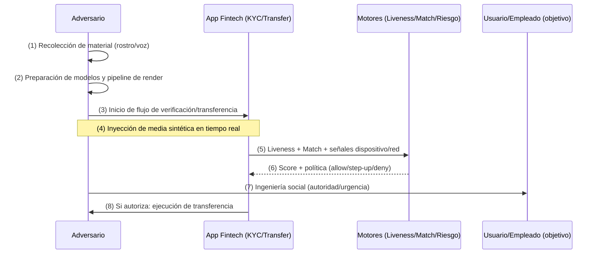
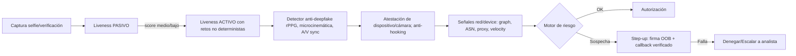
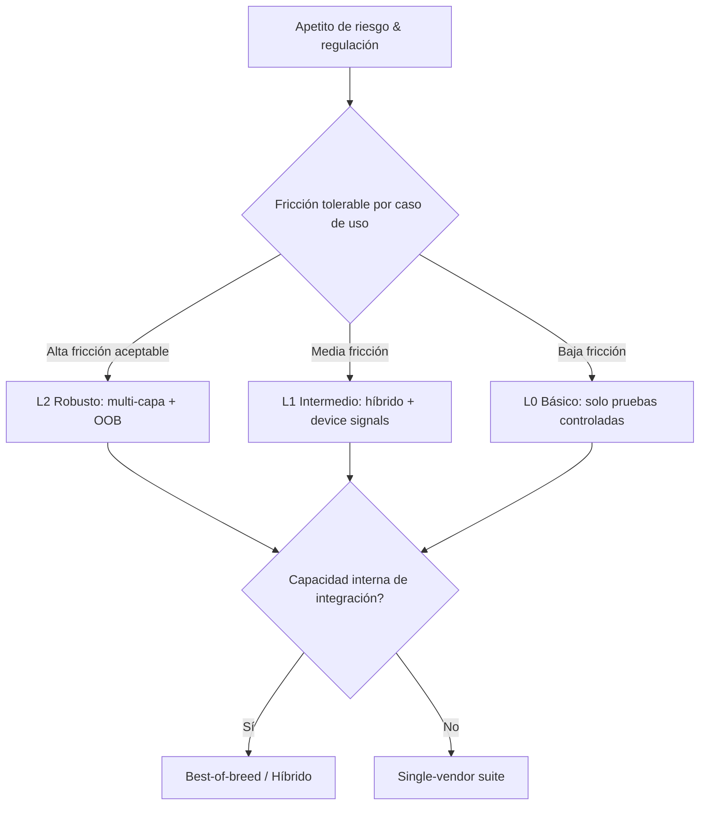
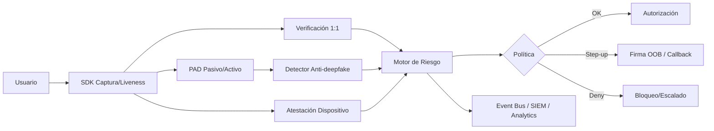
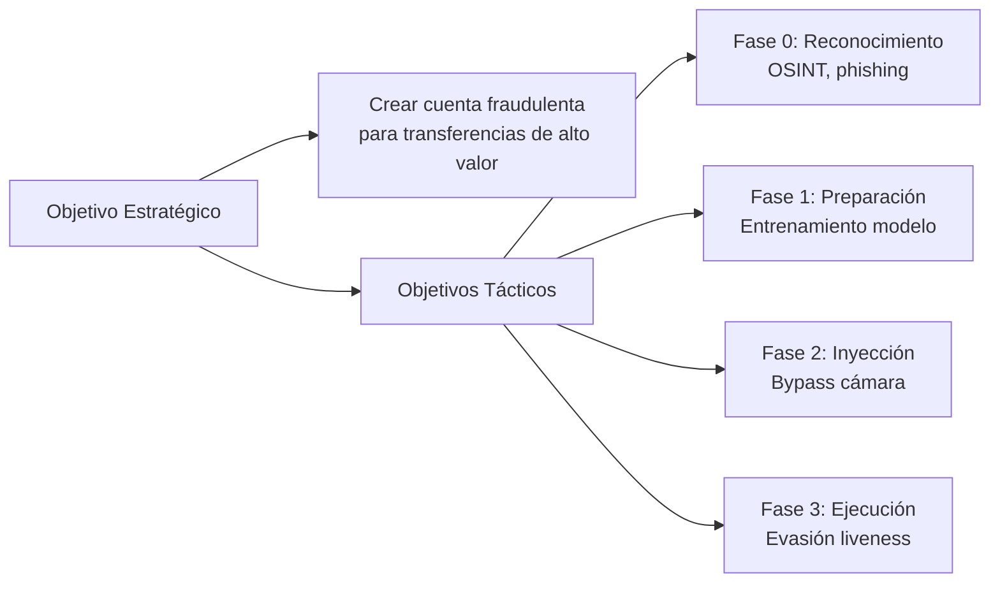
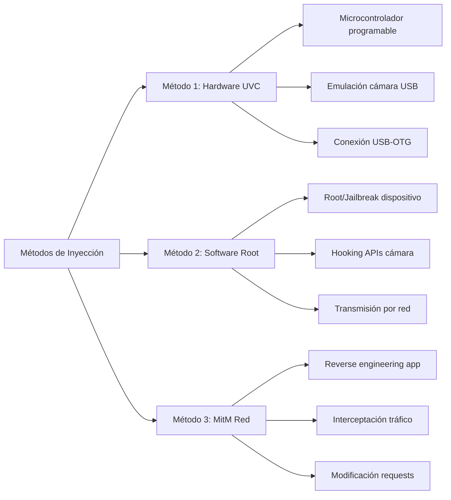
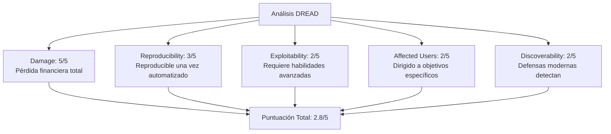
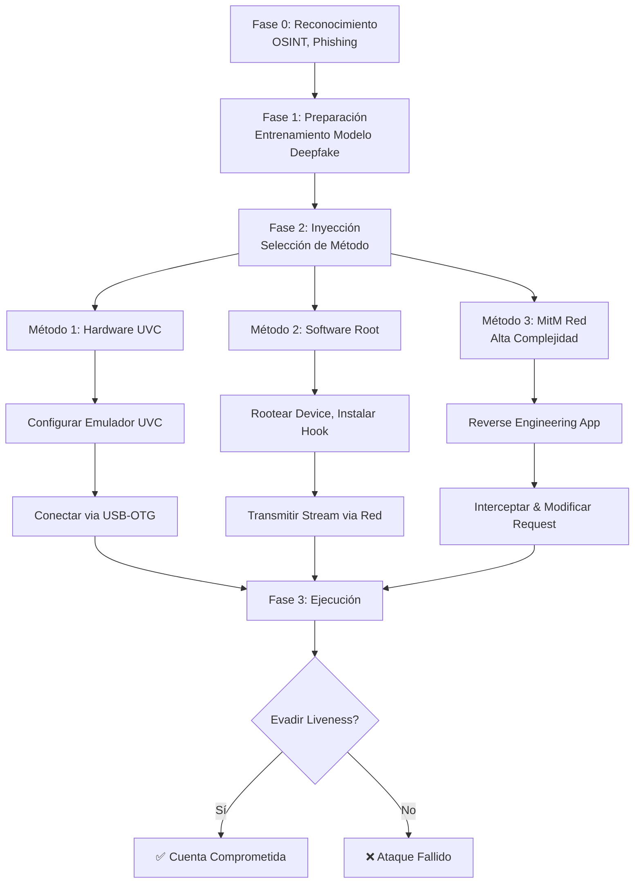

# Informe técnico: *Deepfakes* en tiempo real contra verificación facial en apps fintech — tácticas del adversario, señales y defensas (enfoque defensivo)

> **Aviso**: Este documento describe tácticas y señales **a nivel alto** para comprender el riesgo y **fortalecer defensas**. **No** incluye instrucciones operativas ni “recetas” para vulnerar sistemas financieros.

---

## 0) Resumen ejecutivo

- En 2024–2025 aumentan las estafas corporativas con *deepfakes* (video/voz) para inducir **transferencias** y **recuperación de cuentas**. Casos mediáticos reportan pérdidas multimillonarias por suplantación de altos cargos en videollamadas.
- Marcos/estándares útiles: **ISO/IEC 30107-3** (PAD), **NIST FRTE/FRVT** (verificación 1:1), **NISTIR 8491** (PAD pasivo), **FIDO Biometric Certification** (liveness). Los catálogos previos **no** anticipaban totalmente *deepfakes* y “camera bypasses”; se requieren **capas adicionales**.
- Tendencia 2025: “**repeaters**” o identidades sintéticas que tantean umbrales; necesidad de **correlación entre sesiones** y **validación consorcial**.
- Recomendación central: **defensa en profundidad**: liveness híbrido (pasivo+activo aleatorio), detector anti-*deepfake*, atestación de dispositivo/cámara, señales de red y *device graph*, firma transaccional **out‑of‑band** (OOB) y políticas de riesgo adaptativas.

---

## 1) Modelo de amenaza y objetivos del atacante

**Objetivo primario**: autorizar una transferencia de alto valor o tomar control de la cuenta (onboarding, reverificación, *account recovery*).  
**Condición de éxito**: superar **liveness**, **match 1:1** y **controles de riesgo** (dispositivo/red/correlación).

**Capacidades mínimas del adversario (no operativas)**
- Obtención de **material de entrenamiento** (rostro/voz) a partir de redes sociales, webinars, reuniones públicas.
- **Orquestación en vivo**: render de rostro/voz sintéticos e inyección del flujo hacia la app o el sistema de captura.
- **Ingeniería social** de autoridad/urgencia (p. ej., “CFO” o “soporte” que presiona).
- **Sondeo** previo mediante **repeaters** (microvariaciones) para detectar umbrales.

---

## 2) Cadena de ataque esencial (alto nivel)

**Puntos de explotación y señales defensivas**  
1) **Material de origen** → Señales: limitar huella audiovisual pública, *watermarking* interno y *takedown*.  
2) **Inyección multimedia** → Señales: bloqueo de cámaras virtuales, atestación de integridad, anti‑hooking.  
3) **Liveness** → Señales: retos **no deterministas**, **rPPG**, luz dinámica, microcinemática.  
4) **Correlación** → Señales: *device graph*, ASNs, patrones de *device farms*, **repeaters**.  
5) **Autorización** → Señales: **firma OOB** con monto/destino explícito en canal distinto.  
6) **Ingeniería social** → Señales: *callback* a números verificados, “dos pares de ojos”.

---

## 3) Variantes de ataque (A1–A5), señales y viabilidad

| Código | Variante | Descripción (alto nivel) | Señales útiles | Viabilidad si defensa es… L0 / L1 / L2* |
|---|---|---|---|---|
| **A1** | Sintético en vivo (*face-swap/regen*) | Render del rostro sobre actor; sincronía audio-labial | **rPPG** débil, contornos con *jitter*, reflejos/sombras incoherentes | Alta / Media / Baja |
| **A2** | *Replay* / *player-in-the-middle* | Secuencias con parpadeo/movimientos generados | Inconsistencias de profundidad/autoenfoque; latencias periódicas | Alta / Media‑Baja / Baja |
| **A3** | *Avatar/Puppet* 3D | Modelo 3D animado paramétricamente | Fallas ante luz dinámica; mapas de profundidad “planos” | Media‑Alta / Media / Baja |
| **A4** | Instrumentos físicos (2D/3D) | Máscaras, impresiones, pantallas | Textura/reflectancia anómala; **rPPG** nulo; moiré | Media / Baja / Muy baja |
| **A5** | **Repeaters** (sondeo) | Microvariantes para tantear umbrales | Reutilización de dispositivos/ASN; grafos inter‑cuentas | Alta si no hay consorcio; baja si lo hay |

\* **L0**: liveness básico, sin atestación ni grafos. **L1**: liveness híbrido + señales de dispositivo/red. **L2**: agrega detector anti‑deepfake, **consorcio** y firma OOB.

---

## 4) Liveness y verificación: qué mide cada marco

- **ISO/IEC 30107‑3 (PAD)**: metodología de pruebas de **ataques de presentación** y métricas **APCER/BPCER**.
- **NIST FRTE/FRVT**: precisión de verificación 1:1 (tasas **FMR/FNMR**) y curvas DET/ROC.
- **NISTIR 8491 (FATE PAD)**: desempeño de **PAD pasivo** (software‑only) frente a múltiples PAIs.
- **FIDO Biometric Certification (v4.x)**: requisitos y pruebas de liveness/biometría en laboratorios acreditados.

---

## 5) Señales avanzadas de detección (profundizadas)

1) **rPPG** (fotopletismografía remota): microcambios de color correlacionados con el pulso; en sintéticos/replays la coherencia espacio‑temporal suele fallar.  
2) **Coherencia foto‑geométrica**: reflejos en córnea/lentes, sombras dinámicas y *specular highlights* acordes a la escena.  
3) **Profundidad/IR/ToF**: diferencia cara 3D vs. plano o avatar; complementa PAD pasivo.  
4) **Microcinemática facial**: *time‑warping* en parpadeo y “rigidez” en comisuras bajo estrés del modelo.  
5) **Audio‑visual**: desfases de *lip‑sync* al forzar lectura de frases aleatorias.  
6) **Entorno/transporte**: cámaras virtuales, drivers inusuales, *root/jailbreak*, *hooks*, ASNs/proxies residenciales, *velocity*.  
7) **Correlación consorcial (repeaters)**: grafos de dispositivo‑identidad‑método; bloquea tanteos iterativos.

---

## 6) “Partes esenciales del ataque” — TTPs a nivel alto (sin receta)

### 6.1 Recolección y preparación
- **Qué busca** el adversario: minutos de rostro/voz con variabilidad; documentos filtrados; patrón de retos.  
- **Defensa**: higiene de marca, acotar huella audiovisual, rotación impredecible de retos, monitoreo de fugas.

### 6.2 Orquestación en vivo (inyección multimedia)
- **Qué busca**: interponer un flujo sintético hacia el sistema de captura.  
- **Defensa**: **atestación** de app/OS, bloqueo de cámaras virtuales, validación de integridad, telemetría de latencia/jitter.

### 6.3 Evasión de liveness
- **Qué busca**: minimizar movimientos complejos y controlar iluminación.  
- **Defensa**: **liveness híbrido** con retos no deterministas (gestos/luz/lectura), **rPPG** y análisis de profundidad.

### 6.4 Superación de verificación 1:1
- **Qué busca**: *match* alto rostro↔plantilla/foto.  
- **Defensa**: umbrales adaptativos por riesgo y **selección de proveedores** con evidencia pública (NIST).

### 6.5 Última milla (autorización)
- **Qué busca**: que la app **autorice** el movimiento; suele combinar ingeniería social (autoridad/urgencia).  
- **Defensa**: **firma OOB** con monto/destino, *callback* a números verificados, “dos pares de ojos”.

---

## 7) Casuística (reales y ficticias)

### 7.1 Reales
- Suplantación de ejecutivos mediante videollamada con “equipo” también falso; se efectuaron múltiples transferencias por ~US$25M. Refuerza la necesidad de **controles fuera de la videollamada** y de **firma OOB**.

### 7.2 Ficticia (diseño de controles)
- **“Transferencia escalonada”**: 5 identidades **repeater** tantean el liveness; el **device graph** revela reuso de entorno; *step‑up* con luz dinámica + lectura OOB → falla *lip‑sync* y rPPG → bloqueo.

---

## 8) Probabilidades de éxito y viabilidad (estimaciones orientativas)

> Para **modelado de riesgo**; ajusta con tus métricas APCER/BPCER/FMR/FNMR y datos de campo.

| Escenario | Defensa | Éxito A1–A5 (rango) | Comentario |
|---|---|---|---|
| **Básico (L0)** | PAD pasivo básico, sin atestación ni grafo | **40–70%** | Vulnerable a A1/A2; la “última milla” suele ser humana |
| **Intermedio (L1)** | Liveness híbrido + señales de dispositivo/red | **10–30%** | Baja si hay rPPG + retos dinámicos; riesgo si los retos son predecibles |
| **Robusto (L2)** | + Anti‑deepfake + consorcio + firma OOB | **1–5%** | Residuales dependen de ingeniería social interna |

---

## 9) Programa de pruebas (ampliado)

**Métricas formales**: **APCER/BPCER** (PAD), **FMR/FNMR** (1:1), curvas DET/ROC; **NISTIR 8491** para PAD pasivo.  
**Plan**:  
1) Pruebas de **captura** y **sistema completo** según ISO 30107‑3 (incluye PAI species).  
2) **Face‑in‑Video** con degradaciones (bitrate/compresión) + retos aleatorios; medir *lip‑sync* y rPPG.  
3) Banco de **sintéticos** curado éticamente + *red team* interno con salvaguardas.  
4) **Cross‑session & consortium**: simular **repeaters** y medir detección a nivel de grafo.  
5) **Auditoría FIDO** para liveness/biometría en componentes.

---

## 10) Arquitectura de defensa en profundidad (detallada)

**Claves**: rotación de retos, *hardening* del entorno (cámara real > virtual), **firma OOB** con monto/destinatario visibles, **compartición consorcial** para frenar *repeaters* inter‑plataforma.

---

## 11) Lista accionable (checklist)

- [ ] Inventario de superficies: onboarding, reverificación, *account recovery*  
- [ ] **Liveness híbrido** (pasivo+activo aleatorio) + **detector anti‑deepfake**  
- [ ] **rPPG** y luz dinámica (donde aplique)  
- [ ] **Atestación**: bloqueo de cámaras virtuales, postura de OS, anti‑hooking  
- [ ] **Device/Identity graph** y **consorcio** (detectar **repeaters**)  
- [ ] **Firma OOB** y “dos pares de ojos” para ≥P95 de riesgo  
- [ ] Programa de pruebas ISO 30107‑3 + NIST (vídeo)  
- [ ] Auditoría **FIDO** + *bug bounty* / *red team* ético  
- [ ] Capacitación anti‑ingeniería social y procedimientos de verificación secundaria

---

## 12) Glosario mínimo

- **PAD** (*Presentation Attack Detection*): detección de ataques de presentación (ISO 30107‑3)
- **APCER/BPCER**: error al aceptar ataque / rechazar presentación genuina
- **FMR/FNMR**: falsos *match* / falsos *no‑match* (verificación 1:1)
- **NISTIR 8491**: evaluación de **PAD pasivo** (software‑only)
- **rPPG**: fotopletismografía remota (señal fisiológica para liveness)
- **Repeaters**: ataques con microvariantes para tantear umbrales
- **OOB**: *Out‑of‑Band* (firma/confirmación por canal alterno)

---

## 13) Referencias (selección)

- ISO/IEC 30107‑3 (PAD); Ediciones 2017 y 2023.  
- NIST FRTE/FRVT (evaluaciones de verificación facial 1:1/1:N).  
- NISTIR 8491 (FATE PAD) — PAD pasivo, múltiples PAIs.  
- FIDO Biometric Certification (v4.x) — requisitos y pruebas de liveness.  
- Cobertura periodística 2024–2025 sobre suplantación de ejecutivos con *deepfakes* y fraudes de transferencia.  
- Reportes y alertas de organismos financieros sobre uso de *deepfakes* para circunvenir KYC/CIP y *due diligence*.

---

Medidas Gubernamentales Anti-fraude
---

# Informe técnico: Gobierno y decisiones para definir la seguridad en verificación facial y anti-deepfake en fintech

> **Alcance**: Este informe describe **cómo** una empresa decide el **nivel de seguridad**, **qué capas** componen el sistema (single-vendor vs. multi‑vendor), y **quién** se encarga (comprar producto vs. desarrollo a medida). Se aborda con enfoque **defensivo**, orientado a gestión de riesgos, cumplimiento, arquitectura e integración.

---

## 0) Resumen ejecutivo
- La definición del **nivel de seguridad** es un proceso corporativo que combina **gestión de riesgos**, **cumplimiento regulatorio**, **presupuesto** y **experiencia de usuario**.  
- Las arquitecturas efectivas son **multicapa** (defensa en profundidad), normalmente con **múltiples softwares** y servicios que se integran mediante un **orquestador** de riesgo.  
- En la práctica, lo **más común es comprar** soluciones SaaS/API para biometría y fraude, y **complementarlas** con reglas propias, telemetría y motores de riesgo. El desarrollo 100% a medida se justifica sobre todo en bancos grandes o BigTech.  
- Los **KPIs/KRIs**, pruebas continuas (ISO PAD/NIST), y un **runbook operativo** son claves para sostener el desempeño y el ROI a lo largo del tiempo.

---

## 1) Contexto y objetivos
- **Superficies**: onboarding/eKYC, reverificación por riesgo, *account recovery* y autorización de transferencias.  
- **Amenaza**: *deepfakes* en tiempo real, ataques de “presentación” (PAD), *replays*, *avatars* 3D e identidades “repeaters”.  
- **Objetivo de negocio**: autorizar a los buenos usuarios con mínima fricción y bloquear fraude con alta precisión.  
- **Restricciones**: privacidad/datos, latencia, coste por verificación, cumplimiento (auditorías, reportes, retención).

---

## 2) Gobernanza y proceso de decisión

### 2.1 Actores y RACI (orientativo)
- **CISO / Seguridad** (R/A): política de seguridad, apetito de riesgo, arquitectura de controles.  
- **Riesgo/Fraude** (R): definición de **umbrales de riesgo** y **step‑up**, *device graphing*, telemetría.  
- **Cumplimiento/Legal/Privacidad** (C/A): normativas, contratos, DPIA, *data residency*.  
- **Producto** (C): fricción aceptable por segmento y caso de uso.  
- **Ingeniería/Arquitectura** (R): integración, SLOs, resiliencia.  
- **Data Science/ML** (R): modelos, drift, A/B tests.  
- **Operaciones (Fraud Ops / SoC biométrico)** (R): monitoreo, *triage*, respuesta a incidentes.  

### 2.2 Cadena de decisión (alto nivel)
1) **Apetito de riesgo** y **impacto** (SLE/ALE, pérdidas esperadas).  
2) **Requisitos regulatorios** (ISO PAD, FIDO, NIST, banca local, privacidad).  
3) **Estrategia UX**: fricción presupuestada por caso de uso (alta en transferencias grandes, baja en pagos rutinarios).  
4) **Evaluación de opciones**: *single-vendor suite* vs. *best‑of‑breed* vs. *in‑house*.  
5) **Pilotos y *proofs*** con métricas: APCER/BPCER, FMR/FNMR, tiempo de decisión, tasa de *step‑up*, falsos rechazos.  
6) **Selección y contrato** (SLA/SLO, soporte, *fallback*, *data processing agreement*).  
7) **Despliegue por fases** y **mejora continua** (telemetría, alertas, revisión de umbrales).

---

## 3) Niveles de madurez defensiva (L0–L2)

| Nivel | Descripción | Riesgo residual | Cuándo usar |
|---|---|---|---|
| **L0 – Básico** | Liveness pasivo básico, sin atestación, sin *device graph*. | Alto | MVP, pruebas internas; no recomendado en producción con riesgo alto. |
| **L1 – Intermedio** | Liveness híbrido (pasivo+activo) + señales de dispositivo/red. | Medio | Fintech en crecimiento; balancea fricción y riesgo. |
| **L2 – Robusto** | + Detección anti‑deepfake dedicada + **atestación** + **consorcio/device graph** + **firma OOB**. | Bajo | Transferencias de alto valor, bancos, sectores regulados/objetivo de fraude. |

> **Nota**: el nivel no es global — puede **variar por flujo** (p. ej., L1 en login, L2 en transferencias ≥ percentil 95).

---

## 4) Arquitecturas de solución

### 4.1 Single‑vendor suite
- **Pro**: menor complejidad de integración, *time‑to‑value*, soporte y auditorías más simples.  
- **Con**: menor flexibilidad, riesgo de *vendor lock‑in*, límites en señales avanzadas o anti‑deepfake específico.

### 4.2 Best‑of‑breed (multi‑vendor)
- **Pro**: se eligen mejores módulos por capa (biometría, liveness, anti‑deepfake, riesgo, *device intel*).  
- **Con**: mayor **complejidad de orquestación**, latencia acumulada y responsabilidad difusa ante fallas.

### 4.3 In‑house / Híbrido
- **Pro**: personalización profunda, control de datos, ventaja competitiva en señales propias.  
- **Con**: alto coste de I+D y *run‑ops*, difícil mantenerse al día ante *deepfakes* emergentes.

---

## 5) Diagrama de decisión (mermaid)

---

## 6) Orquestación e integración técnica

### 6.1 Patrón de integración
- **SDK móvil/web** para captura y liveness.  
- **API de verificación** (1:1) y **PAD** (pasivo/activo).  
- **Módulo anti‑deepfake** (señales: rPPG, microcinemática, A/V sync).  
- **Atestación de entorno** (bloqueo de cámaras virtuales, *root/jailbreak*, hooking).  
- **Motor de riesgo** (device graph, velocity, ASN/proxy, correlación cross‑sesión).  
- **Orquestador**: aplica **policy** (umbrales, *step‑up*, denegación, derivación a agente).  
- **Firma OOB** (canal separado con monto/destino).  
- **Event bus** (telemetría, auditoría, SIEM, antifraude).

### 6.2 Diagrama de arquitectura (mermaid)

---

## 7) Evaluación de “comprar vs. construir” (matriz)

| Criterio | Comprar (SaaS/API) | Híbrido | In‑house |
|---|---|---|---|
| *Time‑to‑value* | **Alto** | Medio | Bajo |
| Personalización | Media | **Alta** | **Máxima** |
| Coste inicial | Bajo/medio | Medio | **Alto** |
| OPEX/Run‑ops | Bajo/medio | Medio/alto | **Alto** |
| Cumplimiento/auditoría | **Sencillo** (si vendor certificado) | Medio | Complejo |
| Riesgo tecnológico | Vendor lock‑in | Integración | **Obsolescencia / mantenimiento** |
| Ventaja competitiva | Baja/Media | Media/Alta | **Alta** (si se ejecuta bien) |

**Recomendación típica**: iniciar con **Comprar** (o **Híbrido**), medir KPIs/KRIs y evolucionar según impacto/escala.

---

## 8) Políticas de riesgo y fricción (step‑up)

- **Umbrales adaptativos**: scores combinados (liveness, verificación, entorno, red).  
- **Rutas de *step‑up***: retos activos adicionales, lectura de frase, firma OOB, *callback* a número verificado, verificación humana.  
- **Segmentación**: mayor fricción en **alto monto**, geografías de riesgo, dispositivos nuevos o grafos sospechosos.  
- **Budget de fricción**: mantener métricas de satisfacción/abandono por cohortes para no dañar el negocio.

---

## 9) KPIs y KRIs (monitoring continuo)
- **APCER/BPCER** (PAD), **FMR/FNMR** (1:1), **DET/ROC** por proveedor y versión.  
- **Tasa de *step‑up***, **falsos rechazos** (FRR), **tiempo a decisión**.  
- **Tasa de fraude** por caso de uso y **pérdida esperada**.  
- **Eficacia anti‑deepfake** (detecciones vs. falsos positivos en cohortes controladas).  
- **Disponibilidad** de APIs (SLO), latencia P95/P99, caídas/fallbacks.  
- **Drift** de modelos y *health checks* de señales (rPPG, sync A/V, atestación).

---

## 10) Selección de proveedores (checklist corto)
- Certificaciones/estándares relevantes (ISO PAD, FIDO, reportes públicos de desempeño).  
- Modalidades de despliegue (on‑device, on‑prem, nube), *data residency*, privacidad.  
- SDKs y APIs (latencia, tamaño, soporte multi‑plataforma).  
- Explicabilidad/telemetría (logs, features agregadas, exportabilidad).  
- *Roadmap* y actualización contra nuevas técnicas de *deepfake*.  
- **Plan de fallback** y soporte 24/7.  
- **Costos**: por verificación, por usuario, por sesión; escalamiento con volumen.

---

## 11) Operación continua, respuesta e iteración
- **Runbooks de fraude**: *deny*, *step‑up*, *review*; *triage* en minutos; *watchlists* y *consortium*.  
- **Canary/A‑B** de políticas y modelos; *feature flags*.  
- **Post‑incident reviews** (RCA) con acciones correctivas y aprendizaje cruzado con proveedores.  
- **Entrenamiento y *table‑top exercises*** (ingeniería social + antifraude).

---

## 12) Costos y ROI (orientación)
- **CAPEX/OPEX**: licencias SaaS, consumo en nube, almacenamiento, soporte de 2º/3º nivel, analistas.  
- **Coste por verificación** y **por intento bloqueado**; comparar con **pérdida evitada** (ALE).  
- Modelos **“valor a riesgo”** por caso de uso; priorizar donde el **ROI defensivo** sea más alto.

---

## 13) Hoja de ruta (30–60–90 días)
- **0–30**: RFP/RFQ, *pilot* con 1–2 vendors, definición de KPIs/KRIs, *quick wins* (atestación y firma OOB).  
- **31–60**: Integración orquestada, *feature flags*, *canary* por cohortes, tablero de métricas en tiempo real.  
- **61–90**: Endurecimiento L2 en transferencias de alto valor, consorcio/device graph, *runbooks* y *playbooks* operativos.

---

## 14) Lista de verificación ejecutiva
- [ ] Apetito de riesgo y segmentos de fricción definidos.  
- [ ] Estándares y cumplimiento mapeados (ISO PAD/FIDO/NIST/privacidad).  
- [ ] Arquitectura en capas con orquestación y **fallback**.  
- [ ] KPIs/KRIs y *observability* listos antes del *go‑live*.  
- [ ] Proceso de selección de proveedores con métricas y *pilots*.  
- [ ] Runbooks y entrenamiento de equipos (*table‑tops*).  
- [ ] Revisión trimestral de umbrales, *drift* y pérdidas.

---

### Conclusión
Definir el “tipo de seguridad” no es comprar un único producto, sino **diseñar un sistema**: multicapa, gobernado por **riesgo y cumplimiento**, instrumentado con **métricas**, y con **operación continua**. En la mayoría de organizaciones, la mejor relación **impacto/tiempo** surge de **comprar** módulos líderes y **orquestarlos** con políticas y señales propias.

### Nota final sobre alcance
Se incluyen **partes esenciales del ataque** a nivel táctico (sin detalles operativos) y una expansión de **señales, métricas y arquitectura** para facilitar el **diseño defensivo** y la priorización de controles.

# Metodologia de ataque

# Reporte Técnico: Ataque de Suplantación de Identidad mediante Deepfake en Tiempo Real contra Plataforma FinTech

**Clasificación:** Confidencial - Uso Interno (Evaluación de Amenazas)
**Autor:** Sistema de Análisis de Seguridad
**Fecha:** 21 de marzo de 2025
**Objetivo:** Analizar la viabilidad y metodología para evadir el sistema de verificación facial de una aplicación FinTech dominicana mediante un ataque de deepfake en tiempo real, con el fin de completar el registro fraudulento de una cuenta.

---

## 1. Resumen Ejecutivo

Este documento describe una amenaza de alto nivel dirigida contra los procesos de Onboarding Digital (KYC) de aplicaciones FinTech. El vector de ataque propuesto utiliza un pipeline de **deepfake en tiempo real** combinado con ingeniería social e infección local de dispositivo para suplantar la identidad de un usuario legítimo durante el paso de verificación biométrica facial. El atacante posee previamente información personal de la víctima (cédula, nombre, correo) obtenida mediante otros medios (phishing, filtración de datos, etc.), lo que le permite superar las etapas iniciales de registro. La etapa final de verificación facial, diseñada como una capa de seguridad, es el objetivo a evadir.

La viabilidad técnica del ataque es **MEDIA-ALTA**, pero su ejecución exitosa requiere superar múltiples barreras técnicas y de detección de vivacidad (*liveness*). El riesgo reside en aplicaciones que implementen sistemas de verificación facial débiles o que no utilicen autenticación multifactor (MFA) robusta posterior al registro.

## 2. Objetivo del Ataque

El objetivo final es **completar el proceso de registro y verificación de una cuenta en una aplicación FinTech de transferencias** a nombre de la víctima, sin su conocimiento. El paso crítico a superar es el módulo de verificación facial, que compara una selfie o video en vivo del usuario con la foto de la cédula dominicana previamente subscanned.

**Suposiciones del Atacante:**
*   Posee una copia de alta calidad de la cédula dominicana de la víctima (frente y dorso).
*   Tiene acceso a información personal: nombre completo, fecha de nacimiento, correo electrónico, número de teléfono (para recibir posibles SMS de confirmación).
*   La aplicación FinTech objetivo utiliza verificación facial como último paso de KYC.
*   El atacante tiene habilidades técnicas avanzadas en programación, administración de sistemas y explotación de software (nivel 6-7/10).

## 3. Arquitectura Técnica del Ataque

El ataque se divide en tres fases principales: Preparación, Infección/Interceptación, y Ejecución.

### Fase 1: Preparación del Deepfake y Entorno

1.  **Obtención del Rostro Objetivo:**
    *   La fuente principal será la foto de la cédula. Se requiere un escaneo de alta resolución. Es probable que se necesite aplicar técnicas de preprocesamiento de imagen (Super-Resolution con GANs como ESRGAN, corrección de perspectiva, iluminación) para mejorar la calidad y frontalidad de la imagen, haciéndola apta para el modelo de deepfake.

2.  **Desarrollo/Obtención del Modelo de Deepfake en Tiempo Real:**
    *   **Opción A (Custom):** Entrenar un modelo específico usando la arquitectura **First Order Motion Model (FOMM)** o una **GAN conversacional**. Esto requiere:
        *   Un dataset de la víctima (la foto de la cédula y, idealmente, otras fotos encontradas en redes sociales para mejorar el modelo).
        *   Un dataset de驱动 (conductor) del atacante (videos de él mismo moviendo la cabeza, parpadeando, hablando).
        *   Hardware: GPU potente (NVIDIA RTX 3090/4090 o equivalente) para entrenamiento e inferencia en tiempo real.
    *   **Opción B (Software Existente):** Utilizar herramientas como **DeepFaceLive**, **FaceSwapLive** o frameworks como **SimSwap**. Estas herramientas ofrecen una interfaz más accesible y están optimizadas para funcionar en tiempo real con una webcam.

3.  **Preparación del Entorno de Transmisión:**
    *   Configurar el software de deepfake en una computadora potente con una cámara web de buena calidad.
    *   Probar el modelo extensivamente para minimizar artefactos visuales y asegurar que responde correctamente a los movimientos de la cabeza del atacante.

### Fase 2: Inyección del Stream de Video en el Dispositivo Móvil

Este es el paso técnicamente más complejo. El stream de video de la PC con el deepfake debe ser inyectado en la aplicación FinTech del teléfono, suplantando la señal de la cámara frontal.

**Método 1: Suplantación de Cámara USB por Hardware (Más Fiable)**
*   **Tecnología:** Utilizar un dispositivo **USB video class (UVC) passthrough** o un **microcontrolador programable** (como un Raspberry Pi Pico con firmware especializado) que se presente ante el sistema operativo Android/iOS como una cámara externa.
*   **Herramientas:** Proyectos como **fake-webcam** o **v4l2loopback** en Linux, adaptados para hardware embebido.
*   **Procedimiento:**
    1.  El software de deepfake en la PC envía el video generado a este dispositivo hardware via USB.
    2.  El dispositivo hardware se conecta al teléfono móvil mediante un cable USB-OTG (On-The-Go).
    3.  El teléfono detecta el dispositivo como una cámara USB externa.
    4.  Se utiliza una aplicación de cámara de terceros o se fuerza al sistema a usar la cámara externa por defecto. En algunos casos, puede requerirse root/adb para establecer la cámara predeterminada.
    5.  La app FinTech abre la cámara y recibe el feed del deepfake.

**Método 2: Suplantación por Software con Acceso Root/ADB**
*   **Requisito:** Root en Android o dispositivo iOS jailbroken.
*   **Tecnología:** Modificar el `selinux` policy o usar módulos Magisk/Xposed para inyectar un falso proveedor de cámara.
*   **Herramientas:** `MockCamera` o desarrollo de un módulo personalizado que intercepte las llamadas a la API de la cámara (`Camera2 API` en Android) y las redirija a un socket de red que recibe el stream de la PC.
*   **Procedimiento:**
    1.  La app maliciosa con permisos root se ejecuta en el teléfono.
    2.  Esta app recibe el stream de video de la PC via TCP/UDP (usando WebRTC o RTSP para baja latencia).
    3.  La app intercepta las solicitudes de la cámara y devuelve los frames del stream deepfake.

**Método 3: Ataque Man-in-the-Middle (MitM) en la Comunicación de la App**
*   **Complejidad:** Extremadamente Alta.
*   **Tecnología:** Reverse engineering de la app FinTech para entender su API.
*   **Procedimiento:**
    1.  Descompilar la app (usando `jadx-gui` para Android) para encontrar los endpoints a los que se sube el video de verificación.
    2.  Instalar un certificado CA personalizado en el teléfono para realizar un ataque MitM (ej. con Burp Suite o Fiddler).
    3.  Interceptar la solicitud POST que contiene el video o los datos biométricos.
    4.  Reemplazar el video original en el request por el video deepfake generado y pre-grabado (este método es para bypass de *liveness* básico, no en tiempo real interactivo). Para tiempo real, sería necesario modificar la app misma para reemplazar el feed de la cámara en memoria antes de que sea enviado, lo que es muy complejo.

### Fase 3: Ejecución y Evasión de Liveness Detection

Durante la verificación, la aplicación probablemente realizará pruebas de vivacidad.

*   **Para Liveness Pasivo:** El modelo de deepfake debe ser de alta calidad para minimizar artefactos (errores en el parpadeo, reflejos antinaturales en los ojos, falta de microexpresiones, inconsistencia en la profundidad 3D). La iluminación del atacante debe coincidir con la esperada por el modelo.
*   **Para Liveness Activo:** El atacante debe estar frente a su PC, mirando la instrucción en la pantalla del teléfono (ej. "parpadee", "gire la cabeza") y realizar la acción físicamente. El deepfake en tiempo real replicará estos movimientos en el rostro de la víctima. La **latencia baja** es crítica aquí (<100ms).

## 4. Stack Tecnológico del Atacante

| Componente | Tecnologías/Herramientas Posibles |
| :--- | :--- |
| **Hardware** | GPU NVIDIA de gama alta (RTX 4080/4090), Cámara Web 1080p/4K, Microcontrolador (Raspberry Pi Pico) para suplantación USB, Cable USB-OTG, Teléfono Android rootable. |
| **Software Deepfake** | DeepFaceLive, FaceSwap, First Order Motion Model (FOMM), SimSwap, StyleGAN3. |
| **Desarrollo/Explotación** | Python (PyTorch, TensorFlow, OpenCV), Android SDK (adb), Frameworks para reverse engineering (jadx, Frida, Burp Suite), Linux. |
| **Transmisión/Inyección** | WebRTC, GStreamer, RTSP, v4l2loopback, Software de virtualización de cámaras para Windows (ManyCam, OBS Virtual Cam) + soluciones de redirección. |

## 5. Posibles Contramedidas y Mitigación (Puntos de Falla del Ataque)

Un sistema de verificación robusto puede detectar y bloquear este ataque en múltiples niveles:

1.  **Detección de Vivacidad Avanzada (Liveness 3D):**
    *   **Análisis de Profundidad:** Usar cámaras TrueDepth (iOS) o IR/stereo para crear un mapa 3D del rostro. Un deepfake 2D sería detectado por falta de volumen real.
    *   **Señales Biológicas:** Detección del pulso cardíaco (fotopletismografía) mediante ligeros cambios de color en la piel. Es virtualmente imposible de falsificar con un video.
    *   **Reflejos de Luz 3D:** Analizar cómo la luz se refleja en la geometría 3D única de un rostro real.

2.  **Análisis del Contexto del Dispositivo y la Sesión:**
    *   **Attestation de la Cámara:** Verificar que el video provenga del hardware de la cámara frontal oficial del dispositivo y no de una fuente externa o virtual.
    *   **Detección de Root/Jailbreak:** Bloquear la ejecución de la app en dispositivos comprometidos.
    *   **Análisis de Metadatos:** Verificar los metadatos del video (resolución, fps, codec) que podrían ser incongruentes con los de la cámara nativa.

3.  **Inteligencia Artificial Antifraude:**
    *   Modelos de ML especializados en detectar artefactos específicos de deepfakes (imperfecciones en los dientes, ojos sin vida, borders difusos).

4.  **Autenticación Multifactor (MFA):**
    *   Incluso si se supera la verificación facial, requerir un segundo factor de autenticación independiente (token hardware, código SMS/Email, verificación de voz) para operaciones sensibles como registrar un nuevo beneficiario o realizar una transferencia grande.

## 6. Conclusión y Evaluación de Riesgo

*   **Viabilidad Técnica:** **Media-Alta**. Los componentes necesarios existen y son accesibles para un atacante determinado con recursos.
*   **Probabilidad de Éxito:** **Baja-Media**. Depende críticamente de la sofisticación del sistema objetivo. Una aplicación con verificación 3D y detección de vivacidad basada en señales biológicas tiene una probabilidad muy baja de ser vulnerada por este método. Una aplicación con un sistema 2D básico es mucho más vulnerable.
*   **Complexidad de Ejecución:** **Alta**. Requiere una inversión significativa en tiempo, dinero y expertise técnica. No es un ataque masivo, sino dirigido a objetivos de alto valor.
*   **Recomendación Final:** Este tipo de ataque representa una amenaza real y creciente. Las FinTechs deben priorizar la implementación de soluciones de verificación facial que vayan más allá del análisis 2D, incorporando detección de profundidad 3D, análisis de vivacidad pasiva avanzada y, crucialmente, **capas adicionales de autenticación** que no dependan de un solo factor biométrico. La educación del usuario para proteger su información personal (y thus, la materia prima de estos ataques) sigue siendo la primera línea de defensa.

# Diagramas de ataque y defensa

***Fase 1: Preparación del Entorno***

***Fase 2: Inyección del Stream de Video***

---

# Analisis de viabilidad (Matriz DREAD)

---

# Diagrama completo del ciclo de ataque

